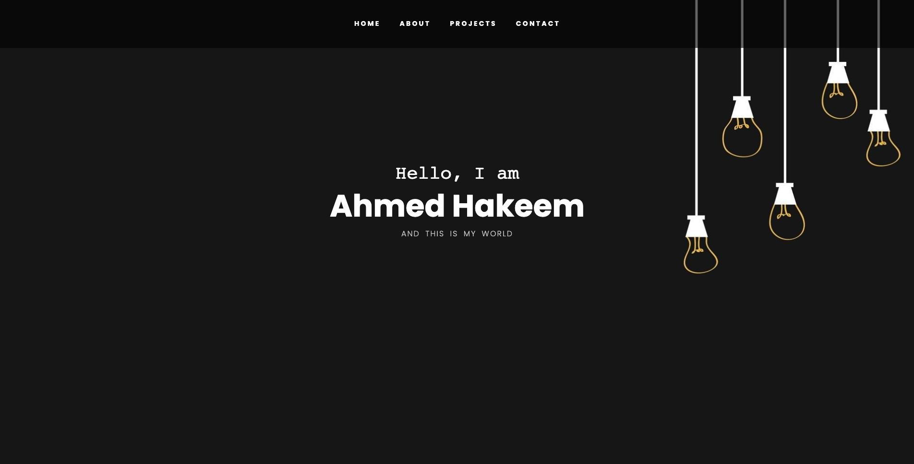
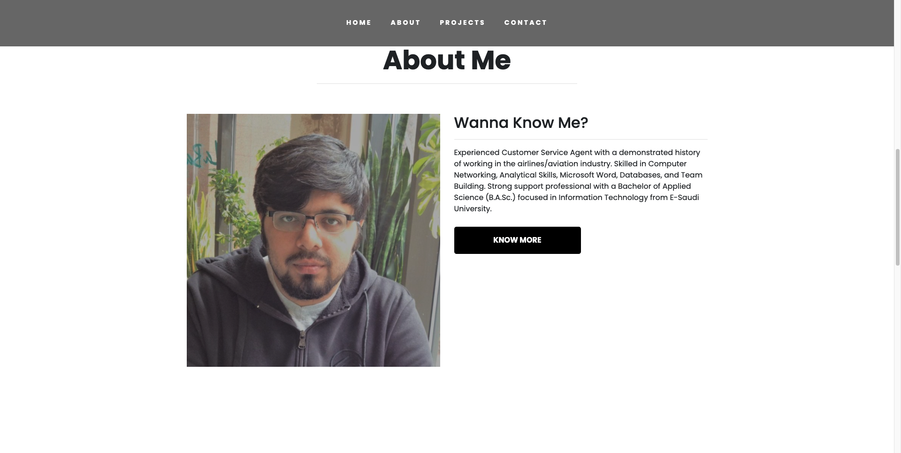
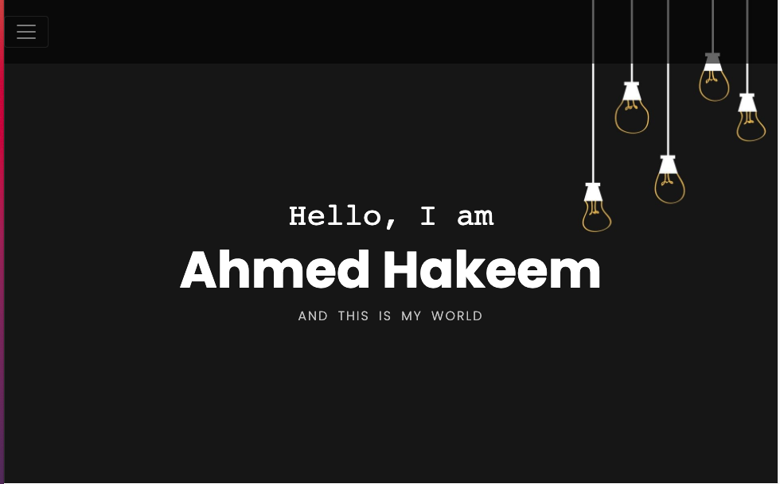
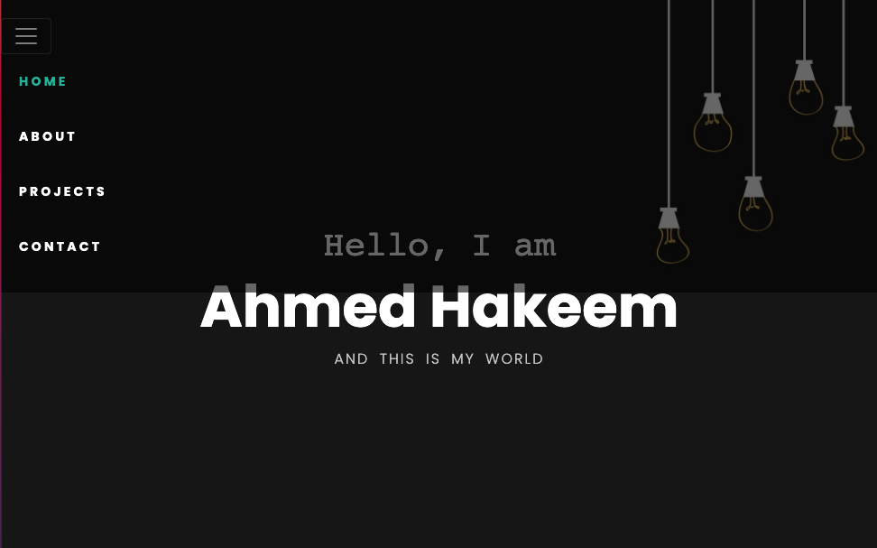
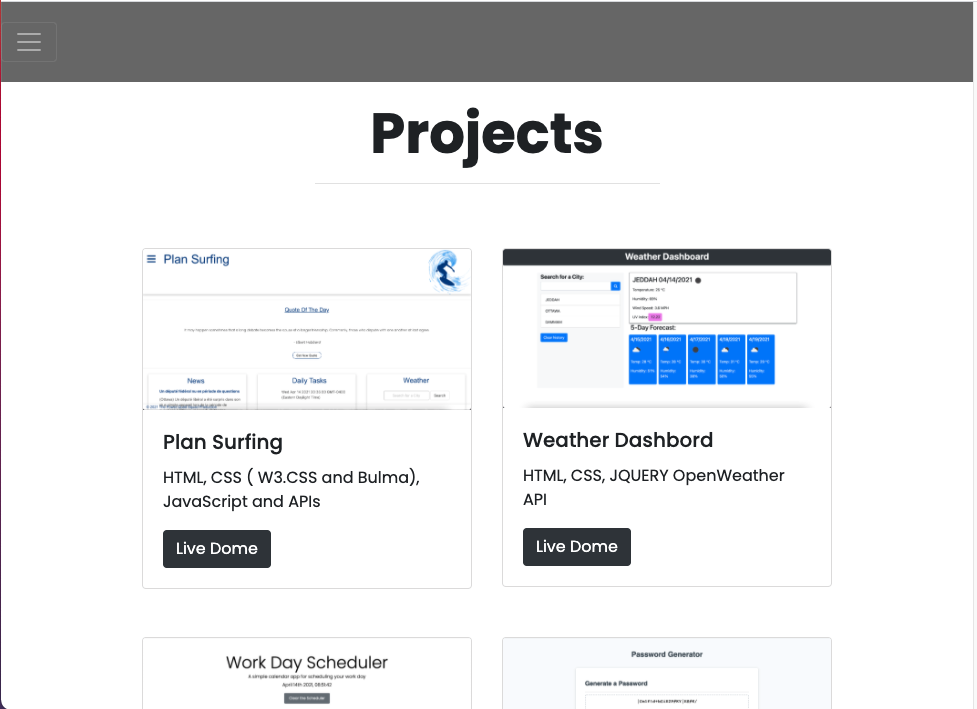
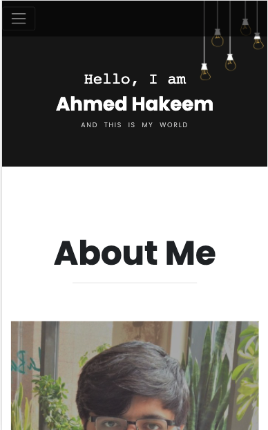
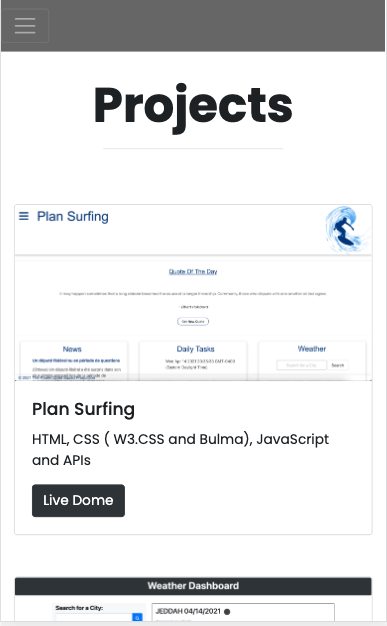

##Table of contents
* General info
* Specifics
* Screenshot
* Deployment of application

##General Info
* This wedsite devolped by HTML and CS

##Specifics
* Font style : Poppins imprted from google font
* frimwork used : Bootstrap 4
* The icons for the cantact section downloded from flaticon.com

##Screenshot

####Desktop :

###Tablet :

###Mobile :

##Deployment of application

[Ahmed's Portfolio Vol-2](https://hakeem235.github.io/Professional-Portfolio-Vol2/)

[GitHub Reop](https://github.com/hakeem235/Professional-Portfolio-Vol2)

### What next :
* appling React.js